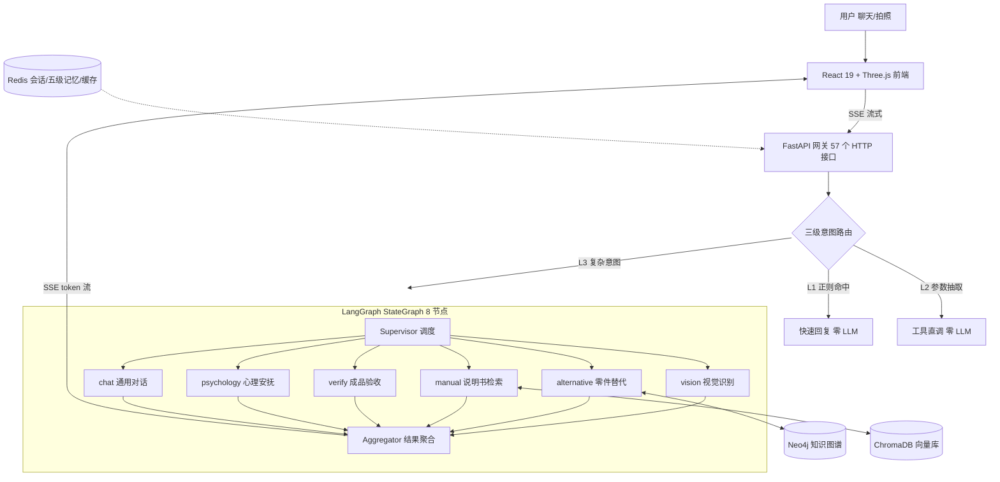
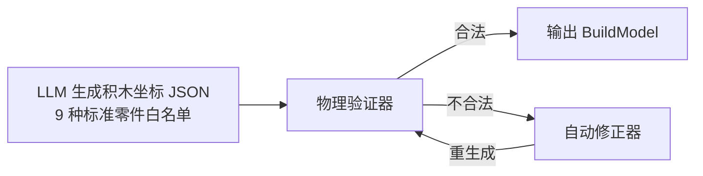

# LEGO-Mate 智能拼搭助手

基于**多模态多 Agent** 的乐高拼搭智能副驾：通过聊天 + 拍照，一站式解决缺件替代、说明书检索、成品验收与 3D 可视化拼搭问题。

## 项目背景

乐高玩家在拼搭过程中普遍面临四个痛点：

- **缺件无解**：少一块砖不知道用什么零件替代，也不确定替代件是否兼容；
- **说明书难查**：纸质说明书翻找步骤麻烦，想知道"第 35 步怎么拼"要来回翻页；
- **拼完没底**：拼了几个小时，不确定成品到底对不对、错在哪一块；
- **中途弃坑**：步骤复杂、反复重试，挫败感强，缺一个"陪拼"的伙伴。

LEGO-Mate 用一个对话式 Agent 系统覆盖上述全流程：上传零件照片即可识别，问"红色 2x4 砖有替代吗"会走知识图谱多跳推理，问"第 35 步怎么拼"会检索说明书图文，传成品图会用 CLIP 视觉对比验收，卡关时还有挫折检测与共情安抚，并配套 React Three.js 的 3D 分步拼装界面。

## 核心功能

| 输入 | 功能 | 背后链路 |
|-----|------|---------|
| 上传零件图片 | 零件识别（型号/颜色/数量） | 视觉 Agent + Qwen2.5-VL / GPT-4o |
| "红色 2x4 砖有替代吗" | 缺件替代推荐 | Neo4j 知识图谱多跳推理 |
| "第 35 步怎么拼" | 说明书步骤检索 | RAG 混合检索 + 多模态解析 |
| "帮我看下对不对" + 成品图 | 拼搭验收 | CLIP 全局 + 九区域相似度对比 |
| "好难啊不想拼了" | 心理安抚 | 挫折检测 + 共情话术库 |
| 文字描述 | 文字→3D 积木模型 | LLM 生成 + 物理验证 + 自动修正 |

## 系统架构



## 实现详解

### 1. 三级意图路由（降本提速）

并非所有请求都需要 LLM 理解，按确定性分三级处理：

- **L1 快速回复**：6 类寒暄/确认意图（问候、感谢、告别、确认等）使用预编译正则匹配，带否定词窗口检测（匹配点前 6 字符内出现"不/没/别"则跳过，防止"不用拼了"被误判），亚秒级返回、零 LLM 调用；
- **L2 工具直调**：4 类工具型意图（替代查询/说明书检索/识图/验收）由规则抽取参数后直调工具——步骤号支持中文数字（"第三十五步"→35），零件号匹配 4-5 位 ID，颜色走复合颜色优先词典；任何必需参数缺失时**不硬猜，自动降级 L3**；
- **L3 完整链路**：Text2API 让 LLM 从注册的工具池中选择并生成参数（置信度 >0.7 才执行，参数类型强校验），复杂意图兜底进入 LangGraph 多 Agent 流程。

意图结果双层缓存（进程内 LRU 256 条 + Redis 5 分钟），配合指代消解（"这一步"自动回填最近步骤号），简单请求完全绕过 LLM。

### 2. LangGraph 多 Agent 协作

`StateGraph` 组织 8 个节点：**Supervisor** → 6 个专家 Agent → **Aggregator**：

- **Supervisor**：消费意图分类结果做条件路由（`add_conditional_edges`），各专家共享一份类型化 State；
- **6 专家 Agent**：vision（视觉识别）、alternative（零件替代）、manual（说明书检索）、verify（成品验收）、psychology（心理安抚）、chat（通用对话），每个 Agent 挂独立降级策略；
- **Aggregator**：将各 Agent 结构化结果格式化后交 LLM 汇总生成最终回复；LLM 失败时按"心理安抚 > 视觉 > 替代 > 说明书 > 验收"优先级规则化拼接，保证任何情况下有结构化输出。

可靠性配套：全链路超时矩阵（Supervisor 5s / 单 Agent 15s / 聚合 10s / 整体 30s）、循环检测（同一 Agent+工具连续调用 3 次即熔断、最大迭代 5 次）、跨 Agent 事实一致性校验（双源置信度均 >0.8 时做否定词矛盾检测，防幻觉传播）。

### 3. Neo4j 多模态知识图谱

- **Schema**：7 类节点（Set / SubAssembly / Part / Step / Color / Category / Image）、13 类关系（CONTAINS、CAN_REPLACE、COMPATIBLE_WITH、INCOMPATIBLE_WITH、DEPENDS_ON 等），13 条模板化 Cypher 查询 + 关系源/目标类型约束；
- **知识规模**：内置 16 个标准零件（含几何/物理/商业属性），程序化生成 **1000+ 扩展零件**知识库与颜色变体；
- **三种图推理引擎**（图算法 + LLM 混合）：
  - *约束传播推理*：提取缺失零件 → 沿 `CAN_REPLACE*1..3` 多跳找候选 → 排除已有件与 `INCOMPATIBLE_WITH` 冲突件 → 按"兼容性 × 置信度"排序；
  - *步骤链推理*：BFS（最大深度 4）分析步骤依赖，判断步骤可否跳过；
  - *稳定性推理*：按连接强度与凸点数计算结构稳定性评分（阈值 0.7 稳固 / 0.4 一般）；
- **兼容性评分**：五维加权——尺寸相似度 30% + 凸点兼容 25% + 连接类型 20% + 类别匹配 15% + 高度兼容 10%；
- **降级设计**：Neo4j 不可用时自动切换内存图存储（BFS 等价实现多跳查询，综合得分 = 兼容性 × 置信度 / (距离+1)），替代查询缓存 30 分钟。

### 4. 六路召回与融合检索

- **六路召回**：多级记忆（Redis 对话历史）、向量检索（ChromaDB）、图谱检索、图谱跨模态（文本→图片）、跨模态检索（图片→文本）、LLM 图谱深度推理（由规则引擎触发：≥2 个零件号 + 替代关键词才启动约束推理，避免无谓的 LLM 开销）；
- **三种可配置融合策略**（`FusionConfig`）：加权融合（memory 0.30 / vector 0.25 / graph 0.25 / cross_modal 0.20）、**RRF**（Reciprocal Rank Fusion，k=60，只看排名不依赖分数归一化）、max-confidence；
- **去重**：N-gram Jaccard 相似度（短文本 bigram、长文本 trigram），阈值 0.85；
- **Token 预算化上下文组装**：总预算 4000 token（系统提示 500 / 用户画像 300 / 记忆 1000 / 检索内容 1500 / 回复预留 1000），中英文分别按 1.5 / 4 字符每 token 估算，超区截断。

### 5. RAG 与多模态说明书解析

- **Embedding**：本地 HuggingFace `BAAI/bge-small-zh-v1.5`（中文优化，CPU 可跑，无需 API Key），向量库 ChromaDB 持久化；
- **混合检索**：向量召回（top_k×2）+ 关键词精确匹配（步骤号命中得分 1.0、关键词包含 0.7），支持按套装/文档类型元数据过滤；分块 chunk 500 / overlap 50，批量 50 条入库；
- **多模态解析**：PDF 说明书不做 OCR，而是 pymupdf 200dpi 整页渲染 + 版面分析（文本块分类为步骤区/零件列表区/文字区，相邻区域合并），每页产出文本 + 图片**双通道语料**，图片落文件系统；
- **视觉编码**：SigLIP / CLIP / 乐高微调 CLIP 三种后端（微调模型加载失败自动回退标准 CLIP），向量 L2 归一化 + 余弦相似度，文搜图与图搜文各 50% 权重融合。

### 6. 文字→3D 生成-验证-修正闭环

LLM 直接生成 3D 模型的合法率很低（悬浮砖、越界、不连通），因此采用**约束生成 + 验证修正闭环**（最多 3 轮）：



- **物理验证器**：基于三维占用网格（`(x,y,z) → brick` 字典）实现 4 条规则——① 16×16 底板边界检查；② 重力支撑（悬空面积 >50% 判非法）；③ 完全悬空检测；④ BFS 六向邻接连通性检查；
- **自动修正器**：越界→平移回底板；悬空→逐格补 1x1 支撑砖（零件 3005）；不连通→添加连接砖；
- **容错**：LLM 输出 JSON 三级回退解析（直接解析 → 代码块提取 → 正则提取），part_id 白名单正则校验，全部失败降级 fallback 模板模型。

### 7. CLIP 成品验收

- 全图统一 224×224 后做**全局 + 3×3 九区域**双重相似度对比，综合评分 = 全局 ×0.6 + 区域均值 ×0.3 + **最差区域 ×0.1**（最差区域项用于揪出"整体像素但关键部位拼错"的情况）；
- 判定阈值：综合分 ≥0.75 且最差区域 ≥0.4 → **pass**；≥0.55 → **review**（并列出低于 0.5 的区域名，提示用户对照）；否则 **fail**；
- 区域级对比可定位局部拼错位置，CLIP 模型懒加载 + 全局缓存，加载失败自动降级 Mock 模式。

### 8. L0-L4 五级记忆

| 层级 | 内容 | 存储 | 关键参数 |
|------|------|------|---------|
| L0 工作记忆 | 当前会话实体状态 | 进程内存 + Redis Hash 双写 | TTL 7 天 |
| L1 短期记忆 | 完整对话消息 | Redis List | TTL 30 天，上限 100 条 |
| L2 中期记忆 | 按套装维度的对话摘要 | Redis JSON | 每累计 10 条新消息触发摘要 |
| L3 长期记忆 | 用户画像（偏好/历史套装） | Redis String | 每 10 条消息更新一次 |
| L4 程序记忆 | 零件/步骤/套装知识 | Neo4j + ChromaDB（只读） | — |

- **重要度驱动的淘汰**：消息打分（验收结果 0.8 > 工具调用 0.7 > 用户提问 0.6 > 安抚 0.3），超限清理时重要度 >0.6 的消息强保留；
- **实体提取 + 指代消解**：正则族识别零件号/步骤号/复合颜色/数量，"这一步/上一步"自动回填上下文中的具体步骤号。

### 9. 心理感知与挫折检测

- **三信号加权累积挫折分**（0-100）：负面关键词命中（中英文 37 词）每个 +25；同一问题重试超 2 次后每次 +15×(n-2) 递进；挂起超 180 秒按比例累计；
- 触发安抚：挫折分 ≥50 / 重试 >2 次 / 挂起 >180s 任一满足；挫折分带 24 小时半衰期衰减，防止历史信号被放大；
- **分级共情话术库**：鼓励语、避坑贴士、冷知识、肯定语、"先肯定后纠正"前缀共 5 类模板，按难度与挫折分分级（≥80 重度 / ≥50 中度）选择，LLM 不可用时纯模板兜底。

### 10. 生产级可靠性设计

| 能力 | 实现 |
|------|------|
| 熔断降级 | 三态熔断器：连续 3 次失败打开，30s 冷却后转半开恢复 |
| 三级缓存 | 内存 LRU（1000 条）+ Redis + 文件，分层 TTL（LLM 结果 1h / 图谱 30min / Embedding 24h / 零件知识永久） |
| 成本闸门 | 单会话 ≤50 次 LLM 调用、每分钟 ≤10 次、≤100k token，使用率 50% 告警、80% 熔断 |
| 资源池 | asyncio 信号量池：Neo4j 3 连接 / RAG 5 连接，获取超时 10s |
| 安全 | 提示注入检测（13 条中英文正则）、输出敏感信息过滤（卡号/密钥）、输入截断与控制字符清洗 |
| 可观测 | Prometheus 指标（HTTP 延迟 9 桶直方图、Agent 调用统计、分层缓存命中）、跨 Agent 链路追踪（trace/span）、JSON 结构化日志 + request_id |
| 状态恢复 | Redis 状态快照（TTL 1h）+ 文件回退，断线可续传 |

## 技术栈

| 层级 | 技术 |
|-----|------|
| 后端 | Python 3.11+ / FastAPI / LangGraph / LangChain / uv 包管理 |
| 数据库 | Neo4j 5.20（知识图谱）/ Redis 7（会话·记忆·缓存）/ ChromaDB（向量） |
| 模型 | LongCat / GPT-4o / Qwen2.5-VL / CLIP / SigLIP / BGE-small-zh |
| 前端 | React 19 / TypeScript / Vite / Zustand / Tailwind / Three.js (react-three-fiber) |
| 工程 | Docker 多阶段构建 / Nginx 金丝雀 / GitHub Actions CI / Prometheus + Grafana / Locust |

## 快速开始

### 环境要求

- Python >= 3.11、[uv](https://github.com/astral-sh/uv)
- Docker Desktop（Neo4j + Redis + 监控栈）
- Node.js >= 18

### 启动步骤

```bash
# 1. 克隆项目
git clone <repo_url>
cd LEGO-Mate

# 2. 安装依赖
uv sync
cd frontend && npm install && cd ..

# 3. 启动基础设施（Neo4j + Redis + Prometheus + Grafana）
docker compose up -d

# 4. 配置环境变量
cp .env.example .env
# 编辑 .env 填入 LLM_API_KEY 等配置（见下表）

# 5. 启动后端
uv run python server.py
# 服务运行在 http://localhost:8000，接口文档 http://localhost:8000/docs

# 6. 启动前端
cd frontend && npm run dev
# 访问 http://localhost:5173
```

### 环境变量

| 变量 | 说明 |
|------|------|
| `LLM_API_KEY` / `LLM_BASE_URL` / `LLM_MODEL` | 主对话 LLM（OpenAI 兼容协议） |
| `VISION_PROVIDER` / `VISION_API_KEY` / `VISION_MODEL` | 视觉模型后端（qwen / openai / ollama） |
| `USE_REAL_VL` | 是否启用真实视觉模型（关闭时走 Mock 便于开发调试） |
| `REDIS_URL` | Redis 连接地址 |
| `HF_ENDPOINT` | HuggingFace 镜像加速（国内推荐） |
| `FEISHU_WEBHOOK_URL` | 飞书告警通知（可选） |

### 数据导入

```bash
# 导入套装/零件知识到图谱与向量库
uv run python data/import_data.py

# 导入 PDF 说明书（多模态解析）
uv run python data/import_manual.py
```

## 项目结构

```
LEGO-Mate
├── server.py                 # FastAPI 入口（57 个 HTTP 接口，SSE 流式）
├── src/
│   ├── agent/                # 多 Agent 核心
│   │   ├── graph.py          #   LangGraph StateGraph（Supervisor → 6 专家 → Aggregator）
│   │   ├── intent_router.py  #   三级意图路由（L1 正则 / L2 工具直调 / L3 LLM）
│   │   ├── text2api.py       #   LLM 工具选择 + 参数强校验
│   │   ├── agents/           #   6 个专家 Agent
│   │   └── utils/            #   熔断器/缓存/成本控制/循环检测/链路追踪/资源池…
│   ├── kg/                   # Neo4j 知识图谱（schema/构建/检索/推理）
│   ├── retrieval/            # 六路召回 + 融合策略（RRF/加权）+ Token 预算上下文
│   ├── rag/                  # 向量库/文档加载/多模态解析/视觉编码
│   ├── builder3d/            # 文字→3D 闭环（LLM 生成/物理验证/自动修正）
│   ├── verification/         # CLIP 成品验收（全局 + 九区域）
│   ├── memory/               # L0-L4 五级记忆
│   ├── psychology/           # 挫折检测 + 共情话术库
│   ├── vision/               # 零件识别（Qwen2.5-VL / GPT-4o / Ollama 多后端）
│   ├── session/              # Redis 会话管理
│   └── common/               # 配置/错误处理/单例
├── frontend/                 # React 19 + Three.js（3D 分步拼装、SSE 流式渲染）
├── monitoring/               # Prometheus 告警规则 + Grafana 仪表盘
├── tests/                    # 23 个测试文件（单元/集成/E2E）+ Locust 压测
├── docker-compose.yml        # Neo4j + Redis + Prometheus + Grafana 编排
├── docker-compose.canary.yml # 金丝雀灰度发布（Nginx 切流）
└── Dockerfile                # 三阶段构建（uv frozen → 预编译 → 非 root 运行）
```

## 测试与性能

```bash
# 单元 + 集成测试（覆盖率门槛 80%）
uv run pytest --cov

# Locust 压测：100 并发用户、每秒爬升 10 个、按业务权重分布任务，
# 含 SSE 流式用户类（StreamingUser）
uv run locust -f tests/performance/locustfile.py --users 100 --spawn-rate 10
```

- 23 个测试文件覆盖记忆管理、多 Agent E2E、生产就绪性、图谱推理、物理验证、融合策略等模块；LLM 以 MagicMock 替身驱动异常路径测试；
- CI 在 GitHub Actions services 中启动真实 Neo4j + Redis 容器执行集成测试。

## 部署与监控

- **容器化**：Dockerfile 三阶段构建（dependencies → 字节码预编译 → production），非 root 用户运行，内置 HEALTHCHECK；
- **编排**：`docker compose` 一键拉起 backend + Neo4j 5.20 + Redis 7（AOF 持久化）+ Prometheus + Grafana + Node Exporter，依赖服务带 healthcheck 与启动顺序约束；
- **金丝雀发布**：`docker-compose.canary.yml` + Nginx `split_clients` 按 IP 哈希 10% → 50% → 100% 逐步切流，支持测试人员通过 header 指定路由；
- **CI/CD**：五阶段流水线——ruff lint → pytest（真实容器集成测试 + 覆盖率 80% 门槛）→ 安全扫描（safety + bandit）→ Buildx 构建推送 GHCR → 生产部署；
- **告警**：服务宕机（1 分钟）、5xx 错误率 >10%（5 分钟）、P95 延迟 >2s（5 分钟）、内存 >500MB，支持飞书通知；Grafana 预置项目总览仪表盘。

## License

MIT
